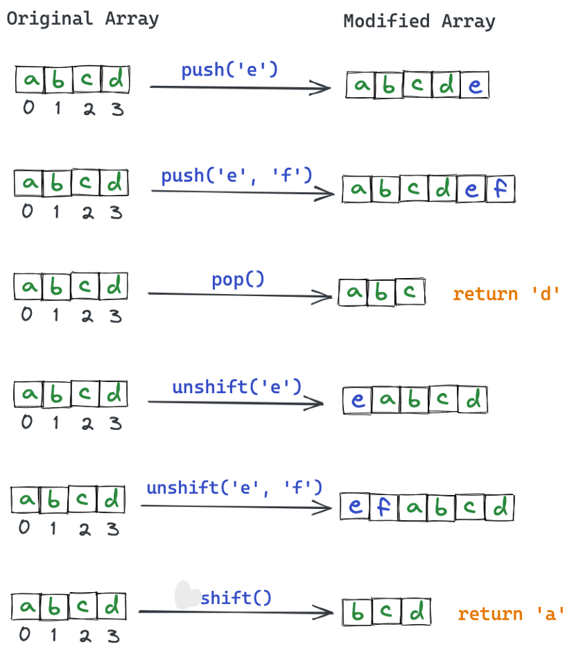
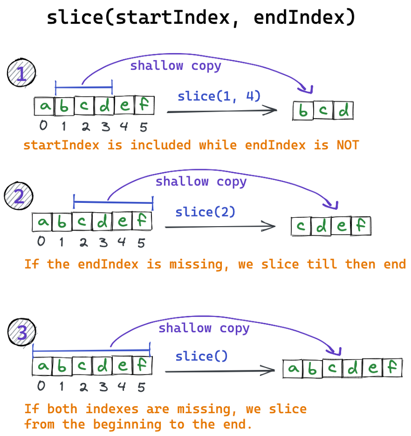
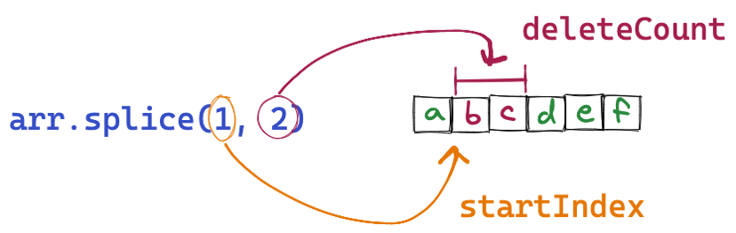
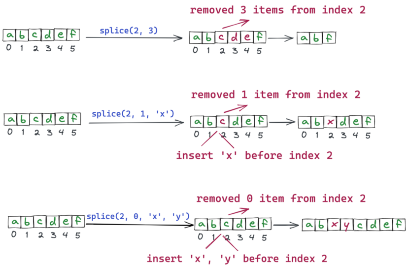
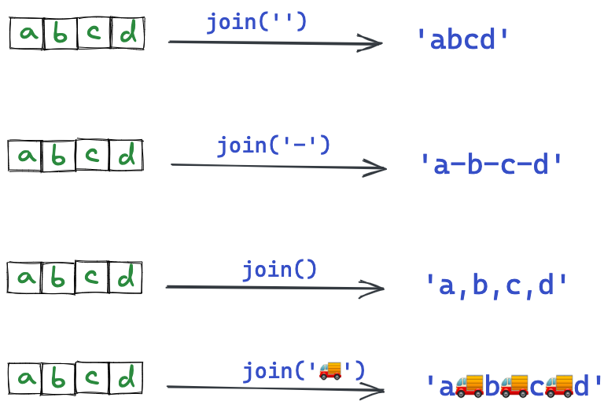
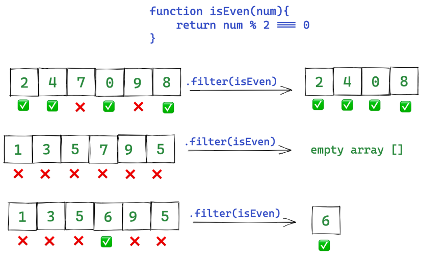
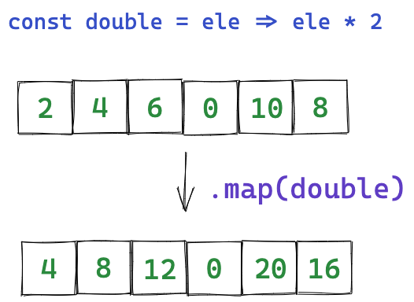
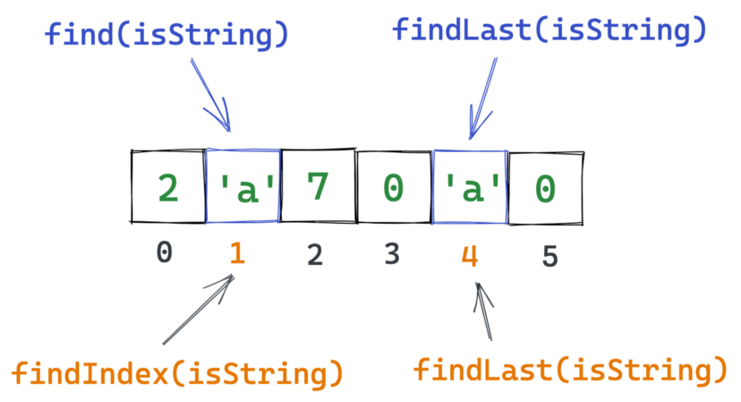

# backend-quiz3

<!-- TABLE OF CONTENTS -->
## Table of Contents

- [backend-quiz3](#backend-quiz3)
  - [Table of Contents](#table-of-contents)
  - [Quiz requirement](#quiz-requirement)
    - [Quiz 1 requirement](#quiz-1-requirement)
    - [Quiz 2 requirement](#quiz-2-requirement)
  - [Quiz 1 Answer](#quiz-1-answer)
    - [JS native](#js-native)
    - [LoDash](#lodash)
    - [Comparison](#comparison)
  - [Quiz 2](#quiz-2)
    - [Set up and run](#set-up-and-run)

<!-- overview -->
## Quiz requirement

### Quiz 1 requirement

In the first task, I am required to list all object and arrays manipulation functions available in Array-native, JavaScript-native and LoDash.
My answer is written on the section [Quiz 1 Answer](#quiz-1-answer)

### Quiz 2 requirement

In the seond task, I am required to write two files - Scale.js and main.js in which:

- **Scale.js** implements the class Scale that has 3 methods:
  - **constructor()**: Initialize the class with an array include the weight of 12 coins, in which one is heavier or lighter than another.
  - **weigh(left, right)**: Take in two array contains coins' index and return 1 if the left is hevier than the right, 2 if the left is equals to the right and 3 for the last case.
  - **checkResult(faultIndex, heavier)**: Take in the index of the fault coin and true if the fault coin is heavier, false if the fault coin is lighter. However, if the user use the function checkResult more than one time, the function will always return false.
- **algo.js** implements the function findFaultCoint that applys the optimized algorithm for solving the problem without accessing the private data of the Scale class.

[back to top](#backend-quiz3)

<!-- GETTING STARTED -->
## Quiz 1 Answer

### JS native

1. **push()**

    Put the element to the back of the array. Return the length of the current

    ```js
      const arr = [1, 2, 3, 4, 5, 6]
      arr.forEach(item => {
        console.log(item * 2); // output: 2 4 5 8 10 12
      })
    ```

2. **pop()**

    The pop() method remove the last element of the array, it will return the removed element.

    ```js
      const arr = [5, 12, 8, 130, 200];
      popElement = arr.pop(); // popElement: 200, arr: [5, 12, 8, 130]
    ```

3. **unshift()**

    The unshift() method adds one or more elements to the beginning of an array and returns its new length.

    ```js
      const array = [1, 2, 3, 4];
      array.unshift(5, 6, 10); // This will return 7. array: [5, 6, 10, 1, 2, 3, 4]
    ```

4. **shift()**

    The shift() method removes the first element from an array and returns the removed element changing the array's length.

    ```js
      const array = [1, 2, 3, 4];
      array.shift(); // This will return 1. array : [2, 3, 4]
    ```

    

5. **slice()**

    The slice make a shallow copy for each element from index = begin to index = end -1, if end is negative, the end index is automatically assign as array.length + end.

    ```js
      let arr = [[1, 2, 3, 4, 5, 6], [1, 2, 5], [3, 5, 7]];
      let newArr = arr.slice(0, 2); // newArr = []
      newArr[0] = [1, 2, 100];
    ```

    

6. **splice()**

    The splice() method changes the contents of an array by removing or replacing existing elements and/or adding new elements in place.

    ```js
      let arr = [[1, 2, 3, 4, 5, 6], [1, 2, 5], [3, 5, 7]];
      let newArr = arr.slice(0, 2); // newArr = []
      newArr[0] = [1, 2, 100];
    ```

    
    

7. **join()**

    The join() method creates and returns a new string by concatenating all of the elements in an array, separated by commas or a specified separator string.

    ```js
      let arr = [[1, 2, 3, 4, 5, 6], [1, 2, 5], [3, 5, 7]];
      let newArr = arr.slice(0, 2); // newArr = []
      newArr[0] = [1, 2, 100];
    ```

    

8. **filter()**

    This method create new array with only elements passed condition inside the provided function. If you make change to the element when filter it, the original element will also be changed.

    ```js
      const arr = [1, 2, 3, 4, 5, 6];
      arr.filter(x => x % 2 === 0);  // arr = [2, 4, 6]
    ```

    

9. **map()**

    This method create new array by calling the provided function in every element. If you make change to the element while mapping, the original element will also be changed.

    ```js
      const arr = [1, 2, 3, 4, 5, 6]
      const newArr = arr.map(num => num*2); // newArr = [2, 4, 6, 8, 10, 12]
    ```

    

10. **find()**

    Returns the value of the first element in the array that satisfies the provided testing function, or undefined if no appropriate element is found.

11. **findIndex()**

    Returns the index of the first element in the array that satisfies the provided testing function, or -1 if no appropriate element was found.

12. **findLast()**

    Returns the value of the last element in the array that satisfies the provided testing function, or undefined if no appropriate element is found.

13. **findLastIndex()**

    Returns the index of the last element in the array that satisfies the provided testing function, or -1 if no appropriate element was found.

    

14. **reduce()**

    The reduce() method applies a function against an accumulator and each element in the array (from left to right) to reduce it to a single value. If you make change to the element when accumulate, the original element will also be changed. Without the inital value, the reduce function will carry out with the first 2 elements. The third element if map function has will be from 0..n. The fourth element is the object that call the map function.

    ```js
      const arr = [1, 2, 3, 4, 5, 6];
      const sum = arr.reduce((total, value) => total + value, 0); // sum = 21
    ```

15. **fill()**

    The fill() method changes all elements in an array to a static value, from a start index (default 0) to an end index (default array.length). It returns the modified array.

    ```js
      fill(value)
      fill(value, start)
      fill(value, start, end)
    ```

16. **includes()**

    This method check if array includes the item passed in the method.

    ```js
      const arr = [1, 2, 3, 4, 5, 6]
      arr.includes(2); // output: true
      arr.includes(7); // output: false
    ```

17. **some()**

    This method check if at least one of array’s item passed the condition. If passed, it return ‘true’ otherwise ‘false’.

    ```js
      const arr = [1, 2, 3, 4, 5, 6];

      // at least one element is greater than 4?
      const largeNum = arr.some(num => num > 4);
      console.log(largeNum); // output: true

      // at least one element is less than or equal to 0?
      const smallNum = arr.some(num => num <= 0);
      console.log(smallNum); // output: false
    ```

18. **every()**

    The reduce() method applies a function against an accumulator and each element in the array (from left to right) to reduce it to a single value.

    ```js
      const arr = [1, 2, 3, 4, 5, 6];

      const sum = arr.reduce((total, value) => total + value, 0);
      console.log(sum); // 21
    ```

19. **forEach()**

    This method can help you to loop over array’s items. If you make change to the element when loop over it, the array will also be changed.

    ```js
      const arr = [1, 2, 3, 4, 5, 6]
      arr.forEach(item => {
        console.log(item * 2); // output: 2 4 5 8 10 12
      })
    ```

20. **sort()**

    The sort() method sorts the elements of an array in place.

    ```js
      let arr = [[1, 2, 3, 4, 5, 6], [1, 2, 5], [3, 5, 7]];
      arr.sort; // arr = [[1, 2, 3, 4, 5, 6], [1, 2, 5], [3, 5, 7];
      arr.sort((a, b) => a.length - b.length); // arr = [[1, 2, 5], [3, 5, 7], [1, 2, 3, 4, 5, 6]];
    ```

21. **concat()**

    The concat() method is used to merge two or more arrays and returns a new array build of this array joined with other arrays. Each element in the array is a shallow copy of the original element.

    ```js
      const array1 = [1, 2];
      const array2 = ['a', 'b', 'c'];
      const array = array1.concat(array2); // array = [1, 2, 'a', 'b', 'c'];
    ```

    _Note: You can use spread syntax instead of concat_

22. **reduceRight()**

    The reduceRight() method executes the callback function once for each element present in the array, receiving four arguments: the initial value (or value from the previous callback call), the current element's value, the current index, and the array over which iteration is occurring.

    ```js
      const sum = [0, 1, 2, 3, 4].reduceRight(function(a, b) {
        return a + b;
      }); // sum = 10;
    ```

23. **reverse()**

    The reverse() method reverse all elements of an array.

    ```js
      const arr = [5, 12, 8, 130, 200];
      arr.reverse(); // arr: [200, 130, 8, 12, 5]
    ```

24. **length**

    Return the length of the array.

    ```js
      const arr = [5, 12, 8, 130, 200];
      arr.length; // output: 5
    ```

25. **spread syntax (...)**

    The spread syntax will make a shallow copy of each element from the original array.

    ```js
      const array = [5, 12, 8, 130, 200];
      const newArr = [1, 2, 3, 4, ...array]; // newArr = [1, 2, 3, 4, 5, 12, 8, 130, 200]
    ```

26. **Array.from()**

    The Array.from() static method creates a new, shallow-copied Array instance from an iterable or array-like object.

    ```js
      console.log(Array.from('foo'));
      // expected output: Array ["f", "o", "o"]

      console.log(Array.from([1, 2, 3], x => x + x));
      // expected output: Array [2, 4, 6]
    ```

27. **Array.of()**

    The Array.of() method creates a new Array instance from a variable number of arguments, regardless of number or type of the arguments.

    ```js
      Array.of(element0)
      Array.of(element0, element1)
      Array.of(element0, element1, /* … ,*/ elementN)
    ```

[back to top](#backend-quiz3)

### LoDash

1. _.assign

    Assigns own enumerable string keyed properties of source objects to the destination object. Source objects are applied from left to right. Subsequent sources overwrite property assignments of previous sources.

    ```js
      const array = [5, 12, 8, 130, 200];
      const newArr = [1, 2, 3, 4];

      array.abc = 1511;
      array[[1, 2, 3, 5, 6]] = [1, 2, 3, 7];

      const obj = Array(10);
      array[obj] = [1, 2, 4]; // array: [5, 12, 8, 130, 200, abc: 1511, '1,2,3,5,6': [ 1, 2, 3, 7 ], ',,,,,,,,,': [ 1, 2, 4 ]]
      _.assign(newArr, array); // newArr: [5, 12, 8, 130, 200, abc: 1511, '1,2,3,5,6': [ 1, 2, 3, 7 ], ',,,,,,,,,': [ 1, 2, 4 ]]
    ```

2. _.times

    _.times receives as arguments the number of iterations and a function to execute n times and returns an array of the results. Very useful when creating dynamic test data.

    ```js
      _.times(3, String);
      // => ['0', '1', '2']

      var result = _.times(5, Math.round(Math.random() * 100));
      // result => [64, 70, 29, 10, 23]
    ```

3. _.find

    Instead iterating through an array with a loop to find a specific object, we can simply use _.find. You can also find an object using multiple properties.

    ```js
      var users = [
        { firstName: "John", lastName: "Doe", age: 28, gender: "male" },
        { firstName: "Jane", lastName: "Doe", age: 5, gender: "female" },
        { firstName: "Jim", lastName: "Carrey", age: 54, gender: "male" },
        { firstName: "Kate", lastName: "Winslet", age: 40, gender: "female" }
      ];

      var user = _.find(users, { lastName: "Doe", gender: "male" });
      // user -> { firstName: "John", lastName: "Doe", age: 28, gender: "male" }

      var underAgeUser = _.find(users, function(user) {
        return user.age < 18;
      });
      // underAgeUser -> { firstName: "Jane", lastName: "Doe", age: 5, gender: "female" }
    ```

4. _.get

    Gets the value at path of object. If the resolved value is undefined, the defaultValue is returned in its place.

    ```js
      var bar = { foo: { key: "foo" } };
      var name = _.get(bar, "name", "John Doe");
      // name => John Doe
    ```

5. ._set

    Sets the value at path of object. If a portion of path doesn't exist, it's created. Arrays are created for missing index properties while objects are created for all other missing properties.

    ```js
      var bar = { foo: { key: "foo" } };
      _.set(bar, "foo.items[0]", "An item");
      // bar => { foo: { key: "foo", items: ["An item"] } }
    ```

6. _.keyBy

    Creates an object composed of keys generated from the results of running each element of collection thru iteratee. The corresponding value of each key is the last element responsible for generating the key. The iteratee is invoked with one argument: (value).

    ```js
      var posts = [
        { id: "1abc", title: "First blog post", content: "..." },
        { id: "2abc", title: "Second blog post", content: "..." },
        { id: "3abc", title: "The blog post we want", content: "..." }
      ];
      posts = _.keyBy(posts, "id");
      // posts: { 
      //  "1abc": { id: "34abc", title: "The blog post we want", content: "..." },
      //  "2abc": { id: "2abc", title: "Second blog post", content: "..." },
      //  "3abc": { id: "3abc", title: "The blog post we want", content: "..." },
      // };
    ```

7. _.clone

    Creates a shallow clone of value.
    _Note: An empty object is returned for uncloneable values such as error objects, functions, DOM nodes, and WeakMaps._

8. _.cloneDeep

    _.cloneDeep will clone an object. The new object will also have a new address in memory so you won’t crush a property from the original object.

    ```js
      let original = { foo: [1, 2, 3] };
      let shallowCopy = _.clone(original);
      let deepCopy = _.cloneDeep(original);
      original.foo[1] = 100;
      // shallowCopy -> { foo: [1, 100, 3] } Yeah!
      // deepCopy -> { foo: [1, 2, 3] } Yeah!
    ```

9. _.sortedUniq

    With this one, all duplicated values won’t be returned. This is usually used for performance reasons, because it is specifically for the sorted arrays.

    ```js
      var sortedArray = [1, 1, 2, 3, 3, 3, 5, 8, 8];
      var result = _.sortedUniq(sortedArray);
      // -> [1, 2, 3, 5, 8]
    ```

10. _.filter

    Given that you want to show a list of fiction books, then:

    ```js
      _.filter(books: { genre: ‘fiction’ });
      _.filter(books: function(book) {
        return book.genre === ‘fiction’ && book.price > 7.5;
      });
    ```

11. _.isEqual

    What do you usually do if you want to compare two objects? Compare every single property or using JSON.stringify?
    Have you tried Lodash’s isEqual? You may not see the significant value of it until you have to handle deeply nested objects.
    With just a simple call, isEqual will take the comparison to the deep level.

    ```js
      let book1 = {
        name: ‘JavaScript: The Good Parts’,
        price: 13.5
      };
      let book2 = {
        name: ‘JavaScript: The Good Parts’,
        price: 13.5
      };
      console.log(_.isEqual(book1, book2)); // true
    ```

12. _.pick

    This function is useful when you want to form a new object based on the properties of the existing object.

    ```js
      let product = {
        name: ‘Learning React Native’,
        category: ‘Book’,
        price: 15,
        discount: 0.3
      };
      let newProduct = _.pick(product, [‘name’, ‘price’]);
      console.log(newProduct); // { name: ‘Learning React Native, price: 15 }
    ```

13. _.omit

    You can also excuse this task in an inverted manner by using omit function:

    ```js
      let product = {
        name: ‘Learning React Native’,
        category: ‘Book’,
        price: 15,
        discount: 0.3
      };
      let newProduct = _.omit(product, [category, discount]);
      console.log(newProduct); // { name: ‘Learning React Native, price: 15 }
    ```

14. _.isEmpty

    You use this function when you want to check if an object, a map, a collection, or a set is empty.

    ```js
      let book1 = {};
      console.log(_.isEmpty(book1)); // true;
      let book2 = { name: ‘Learning JavaScript };
      console.log(_.isEmpty(book2)); // false;
      let books1 = [{
        name: ‘Learning JavaScript’
      }, {
        name: ‘Learning React Native’
      }];
      console.log(_.isEmpty(books1)); // false;
      let books2 = [];
      console.log(_.isEmpty(books2)); // true;
      let nullBook = null;
      console.log(_.isEmpty(nullBook)); // true;
      let undefinedBook = undefined;
      console.log(_.isEmpty(undefinedBook)); // true;
    ```

15. _.concat

    You can use concat method to merge arrays:

    ```js
      let array1 = [1, 5, 3, 1];
      let array2 = [7, 25, 21];
      let array3 = [11, 3, 3, 2];
      let mergedArray = _.concat(array1, array2, array3);
      console.log(mergedArray); // [1, 5, 3, 1, 7, 25, 21, 11, 3, 3, 2];
    ```

16. _.union

    In case you want the element’s values of the merged array to be unique, you can use union function:

    ```js
      let mergedArray = _.union(array1, array2, array3);
      console.log(mergedArray); // [1, 5, 3, 7, 25, 21, 11, 2]
    ```

17. _.Difference

    The difference function will produce a new array of values that differ between the first and second arrays. It is vital to note that the locations of the arguments affect the outcomes.

    ```js
      let mergedArray = _.union(array1, array2, array3);
      console.log(mergedArray); // [1, 5, 3, 7, 25, 21, 11, 2]
    ```

18. _.merge

    It functions similarly to Object.assign, except it recurses deep into the underlying structure to update the deeper objects rather than replacing them.

    ```js
      let mergedArray = _.union(array1, array2, array3);
      console.log(mergedArray); // [1, 5, 3, 7, 25, 21, 11, 2]
    ```

19. _.intersection

    It functions similarly to Object.assign, except it recurses deep into the underlying structure to update the deeper objects rather than replacing them.

    ```js
      let mergedArray = _.union(array1, array2, array3);
      console.log(mergedArray); // [1, 5, 3, 7, 25, 21, 11, 2]
    ```

20. _.orderBy

    The orderBy method is similar to sortBy but it allows us to specify the descending or ascending sort order. For descending sort, we specify desc and for ascending we specify asc.

    ```js
      const users = [
        { 'user': 'fred',   'age': 48 },
        { 'user': 'barney', 'age': 36 },
        { 'user': 'fred',   'age': 40 },
        { 'user': 'barney', 'age': 34 }
      ];

      // sort by user in descending order
      console.log(_.orderBy(users, ['user'], ['desc']));

      // sort by user in ascending order and age by descending order
      console.log(_.orderBy(users, ['user', 'age'], ['asc', 'desc']));
    ```

[back to top](#backend-quiz3)

### Comparison

1. **_.filter() vs filter(), _.find() vs find()**

    In native-JS, filter() only accepts the second parameter as function while LoDash accepts JSON object type.
    It is also similar for _.find() and find() in native-JS.

    ```js
      const users = [
        { user: 'barney', age: 36, active: true },
        { user: 'fred', age: 40, active: false },
      ];

      console.log(_.filter(users, { age: 36, active: true }));  // [{ user: 'barney', age: 36, active: true }]
      console.log(_.find(users, { age: 36, active: true }));    //  { user: 'barney', age: 36, active: true }
      console.log(users.filter({ age: 36, active: true }));   // TypeError: #<Object> is not a function
      console.log(users.find({ age: 36, active: true }));     // TypeError: #<Object> is not a function
    ```

2. **..., slice() vs _.clone(), _.deepClone(), _.assign()**

    In native-JS, filter() only accepts the second parameter as function while LoDash accepts JSON object type.

    ```js
      const users = [
        { user: 'barney', age: 36, active: true },
        { user: 'fred', age: 40, active: false },
      ];

      console.log(_.filter(users, { age: 36, active: true })); // [ { user: 'barney', age: 36, active: true } ]
      console.log(users.filter({ age: 36, active: true })); // TypeError: #<Object> is not a function
    ```

3. **..., concat() vs _.concat(), _.union()**

    Both of them all create a shallow copy for the elements and only work with iterable elements.

    ```js
      const arr = [1, 2, 3];
      arr.abc = "This is not iterable!"; // arr: [1, 2, 3, abc: 'This is not iterable!']
      let newArr = [1, ...arr];     // newArr: arr: [1, 1, 2, 3]
      newArr = [1].concat(arr);     // newArr: arr: [1, 1, 2, 3]
      newArr = [1].concat(1, 2, 3); // newArr: arr: [1, 1, 2, 3]
      newArr = _.concat([1], arr);  // newArr: arr: [1, 1, 2, 3]
      newArr = _.union([1], arr);   // newArr: arr: [1, 2, 3]
    ```

4. **_.reduce vs reduce(), _.map() vs map(), _.reduceRight vs reduceRight(), _.concat() vs concat()**

    Those functions in LoDash and JS-native are the same, so if it's unnecessary to download LoDash for those functions only.

5. **_.reduce vs reduce()**

    In native-JS, filter() only accepts the second parameter as function while LoDash accepts JSON object type.

    ```js
      const users = [
        { user: 'barney', age: 36, active: true },
        { user: 'fred', age: 40, active: false },
      ];

      console.log(_.filter(users, { age: 36, active: true })); // [ { user: 'barney', age: 36, active: true } ]
      console.log(users.filter({ age: 36, active: true })); // TypeError: #<Object> is not a function
    ```

[back to top](#backend-quiz3)

## Quiz 2

### Set up and run

_Below is how use can run my code in your computer._

1. Clone my respository by running the command below.

    ```sh
    git clone https://github.com/Weslife2002/backend-quiz3.git
    ```

2. Access the file and run the command below.

    ```sh
    Node algo.js
    ```

3. 1000 test cases for the problems are generated and the result is shown.

[back to top](#backend-quiz3)
